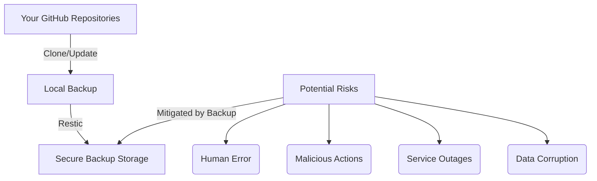

# GitHub Restic Backup

A secure, automated solution for backing up all your personal GitHub repositories using [restic](https://restic.net/). This repository provides a robust workflow to clone or update all your repositories and back them up to an encrypted restic repository. While it is designed to integrate seamlessly with [rclone](https://rclone.org/) for cloud storage, it supports any backend compatible with restic, including local directories.

---

## Purpose

This repository enables you to:

- **Automatically back up all your GitHub repositories** (including private ones) to a secure, encrypted restic repository.
- **Store backups on any restic-compatible backend**, including local storage or a wide range of cloud providers via [rclone](https://rclone.org/).
- **Maintain security best practices** by never exposing your secrets and keeping your credentials safe.

---

## Why You Need Independent GitHub Backups

While GitHub is a fantastic platform for collaboration and version control, it’s not a dedicated backup service. Relying solely on GitHub for your code’s safety can leave you exposed to a variety of risks—some obvious, some less so. Here’s why it’s smart to keep your own independent backups:

- **Human Error**: Accidental deletion of repositories or branches happens more often than you’d think. A single `git push --force` can wipe out history with no easy way back.
- **Malicious Actions**: Accounts can be compromised, or someone with access could intentionally (or unintentionally) delete important code.
- **Service Outages**: Even the best platforms have downtime. If GitHub is unavailable, you could be blocked from accessing your work when you need it most.
- **Data Corruption**: Rare, but possible—files or repositories can become corrupted due to tool bugs or merge conflicts.
- **Compliance Needs**: If you’re working in a business or regulated environment, you may be required to keep independent backups for compliance and peace of mind.

By keeping your own encrypted, automated backups, you’re protecting not just your code, but your productivity and peace of mind. It’s a simple step that can save a lot of headaches down the road.



---

## Features & Workflow

The main script, [`github-restic-backup.sh`](github-restic-backup.sh):

- Authenticates with GitHub using a Personal Access Token (PAT).
- Fetches a list of all your repositories via the GitHub API.
- Clones new repositories and updates existing local copies.
- Uses restic to back up the local repository directory to a destination of your choice (via rclone or local).
- Supports environment-based configuration for secrets and backup parameters.
- Can be scheduled for unattended, regular backups (e.g., via cron).
- Designed for security: secrets are never committed, and sensitive files are excluded via `.gitignore`.

---

## Prerequisites

You will need the following tools installed:

| Tool   | Purpose                        | Install Tips |
|--------|--------------------------------|-------------|
| **bash**   | Script execution (Unix shell) | Most Linux/macOS systems include bash. On Windows, use [Git Bash](https://gitforwindows.org/) or [WSL](https://docs.microsoft.com/en-us/windows/wsl/). |
| **curl**   | API requests                 | `sudo apt install curl` (Debian/Ubuntu), `brew install curl` (macOS), or [download](https://curl.se/download.html) for Windows. |
| **git**    | Clone/update repositories    | `sudo apt install git`, `brew install git`, or [download](https://git-scm.com/downloads). |
| **jq**     | JSON parsing                 | `sudo apt install jq`, `brew install jq`, or [download](https://stedolan.github.io/jq/download/). |
| **restic** | Encrypted backups            | [Install guide](https://restic.readthedocs.io/en/stable/020_installation.html) for all platforms. |
| **rclone** | Cloud storage integration (Optional) | [Install guide](https://rclone.org/install/) for all platforms. |

---

## Setup Instructions

### 1. Create and Secure a GitHub Personal Access Token (PAT)

- Go to [GitHub Settings > Developer settings > Personal access tokens](https://github.com/settings/tokens).
- Click **"Generate new token"** (classic or fine-grained).
- **Scopes required:** `repo` (for private repos), `read:org` (if you want org repos).
- **Copy the token** and save it in a secure file (see below). **Never share or commit this token.**

### 2. Configure Restic

- Choose your backup destination (local, cloud, etc.).
- Initialize a restic repository if you haven't already:
  ```sh
  restic -r <destination> init
  ```
- Set a strong password and save it in a secure file (see below).

### 3. Configure Rclone (Optional, for cloud storage)

- Run:
  ```sh
  rclone config
  ```
- Follow the prompts to set up your remote (e.g., Google Drive, S3, etc.).
- Note the remote name for use in the script (e.g., `gdrive:restic-backups`). If you are not using rclone, you can specify a local path for your restic repository in the `.env` file.

### 4. Set Up Required Environment Files

Create the following files in the same directory as the script (or as specified in the script variables):

- `.github_pat`
  Store your GitHub PAT here.
  **Permissions:** `chmod 600 .github_pat`

- `.restic_pass`
  Store your restic repository password here.
  **Permissions:** `chmod 600 .restic_pass`

**Never commit these files to your repository.**
They are excluded by `.gitignore` by default.

### 5. Configure Environment Variables with `.env`

1. Copy the provided `.env.example` file to `.env`:
   ```sh
   cp .env.example .env
   ```
2. Edit `.env` and fill in your personal values for each variable.
3. **Do not commit your `.env` file to version control.** It is excluded by `.gitignore`.

**Example:**
```env
GITHUB_USER=your-github-username
GITHUB_TOKEN_FILE=$HOME/.github_pat
MIRRORS_DIR=$HOME/github-mirrors
RESTIC_REPOSITORY=rclone:myremote:restic-github-backup
RESTIC_PASSWORD_FILE=$HOME/.restic_pass
RESTIC_KEEP_DAILY=7
RESTIC_KEEP_WEEKLY=4
RESTIC_KEEP_MONTHLY=6
RESTIC_KEEP_YEARLY=2
PARALLEL_JOBS=4
# RESTIC_CHECK_READ_DATA_SUBSET=5G
```

---


## Usage

### 1. Make the Script Executable

```sh
chmod +x github-restic-backup.sh
```

### 2. Run the Script

```sh
./github-restic-backup.sh
```

### 3. Schedule Regular Backups (Optional)

To automate backups, add a cron job:

```sh
crontab -e
```
Add a line like:
```
0 2 * * * /path/to/github-restic-backup.sh
```
This runs the backup every day at 2:00 AM.

---

## Security Best Practices

- **Never commit secrets:** `.github_token`, `.restic_password`, and any other sensitive files must be excluded via `.gitignore`.
- **Set strict permissions:** Use `chmod 600` on secret files to restrict access.
- **Store backups securely:** If using cloud storage, ensure your rclone remote is properly secured.
- **Rotate tokens and passwords regularly.**
- **Review the script before use:** Understand what it does and how it handles your data.

---

## Troubleshooting & FAQ

**Q: The script fails with "authentication error" or "bad credentials".**  
A: Double-check your PAT, its permissions, and that `.github_token` is readable by the script.

**Q: Restic or rclone reports "repository not found" or "access denied".**  
A: Ensure your restic repository is initialized and your rclone remote is configured and accessible.

**Q: Some repositories are missing from the backup.**  
A: Check your PAT scopes and whether you have access to those repositories.

**Q: How do I restore from a backup?**  
A: Use restic’s restore command. See [restic documentation](https://restic.readthedocs.io/en/stable/040_restore.html).

---

## Why Restic and Rclone?

Choosing `restic` and `rclone` for your backup strategy provides a powerful, flexible, and secure solution by combining the strengths of two best-in-class open-source tools. In short, `restic` acts as a highly intelligent backup *engine*, while `rclone` serves as a universal *transporter* for your data to almost any cloud service.

### The Advantages of Restic: The Secure Backup Engine

`Restic` is a modern backup program focused on being simple, fast, efficient, and secure. Its primary role is to handle the logic of creating and managing backups.

- **Security by Default**: Restic's core design principle is security. All data is encrypted end-to-end on your machine *before* it is sent to the storage location using AES-256 encryption. This means that even if someone gains access to your cloud storage, they cannot read your files without your backup password.
- **Powerful Deduplication**: Restic excels at storage efficiency. It breaks your files into unique chunks of data and only stores each chunk once. For subsequent backups, it only uploads new or changed chunks. This dramatically reduces the amount of storage space and time required for backups, especially when backing up similar datasets like multiple Git repositories.
- **Simplicity and Ease of Use**: `Restic` is a single command-line executable that is easy to set up and use without a complex server configuration. Its commands are straightforward, making it accessible to both beginners and experts.
- **Data Integrity and Verifiability**: `Restic` allows you to verify that your backed-up data is intact and can be successfully restored when you need it, giving you confidence in your backup strategy.
- **Versatile Backend Support**: `Restic` can store backups on a wide variety of locations, including local disks, SFTP servers, and several major cloud providers like AWS S3 and Google Cloud Storage.

### The Advantages of Rclone: The Universal Cloud Connector

`Rclone` is often called "The Swiss army knife of cloud storage." Its primary function is to manage and transfer files between your local machine and over 70 different cloud storage providers.

- **Massive Multi-Cloud Support**: `Rclone`'s biggest advantage is its extensive support for a vast array of cloud services, including Google Drive, Dropbox, Amazon S3, Microsoft OneDrive, Box, Backblaze B2, and many more. This gives you the freedom to choose the best storage provider for your needs and avoids vendor lock-in.
- **A Single, Consistent Interface**: Instead of learning the specific tools for each cloud service, you only need to learn `rclone`. It provides a single, powerful command-line interface to perform operations like copying, syncing, moving, and even mounting cloud storage as a local disk across all supported services.
- **Automation and Resilience**: `Rclone` is designed for automation and can be easily integrated into scripts. It can restart transfers over intermittent connections and verifies file integrity with checksums to ensure your data arrives intact.
- **Advanced File Management**: Beyond simple transfers, `rclone` can perform complex file management, data migration between cloud providers, and even apply "wrapper" backends for features like on-the-fly encryption or compression.

### Why They Work So Well Together: A Best-of-Breed Solution

The combination of `restic` and `rclone` creates a backup system that is more powerful than either tool alone. `Restic` natively supports `rclone` as a storage backend, allowing you to seamlessly integrate them.

By using `restic` with `rclone`, you get:
- **Ultimate Flexibility**: You can leverage `restic`'s superior encryption and deduplication capabilities while storing your backups on **any** of the 70+ cloud services supported by `rclone`. This gives you unparalleled choice for your storage destination.
- **Simplified Workflow**: You configure your cloud service once in `rclone` and then simply tell `restic` to use that `rclone` "remote" as its repository. `Restic` handles the backup logic, and `rclone` handles the communication with the cloud provider automatically.
- **Layered Security and Efficiency**: You get `restic`'s robust, client-side encryption and efficient deduplication, combined with `rclone`'s reliable and checksum-verified data transfers.

In essence, you are pairing a top-tier backup program (`restic`) with a top-tier cloud transfer tool (`rclone`) to create a single, cohesive, and extremely capable backup solution.

| Feature | Restic (The Engine) | Rclone (The Transporter) | Together (The Solution) |
| :--- | :--- | :--- | :--- |
| **Primary Role** | Creates secure, deduplicated, snapshot-based backups of data. | Manages and transfers files to and from a vast number of cloud storage providers. | Creates highly secure and efficient backups and stores them on virtually any cloud service. |
| **Key Advantage** | Security (default encryption) and efficiency (deduplication). | Flexibility (70+ supported providers) and a unified command-line interface. | The best of both: Maximum security and efficiency combined with maximum storage flexibility.

---

## License

This project is licensed under the terms of the [LICENSE](LICENSE) file in this repository.